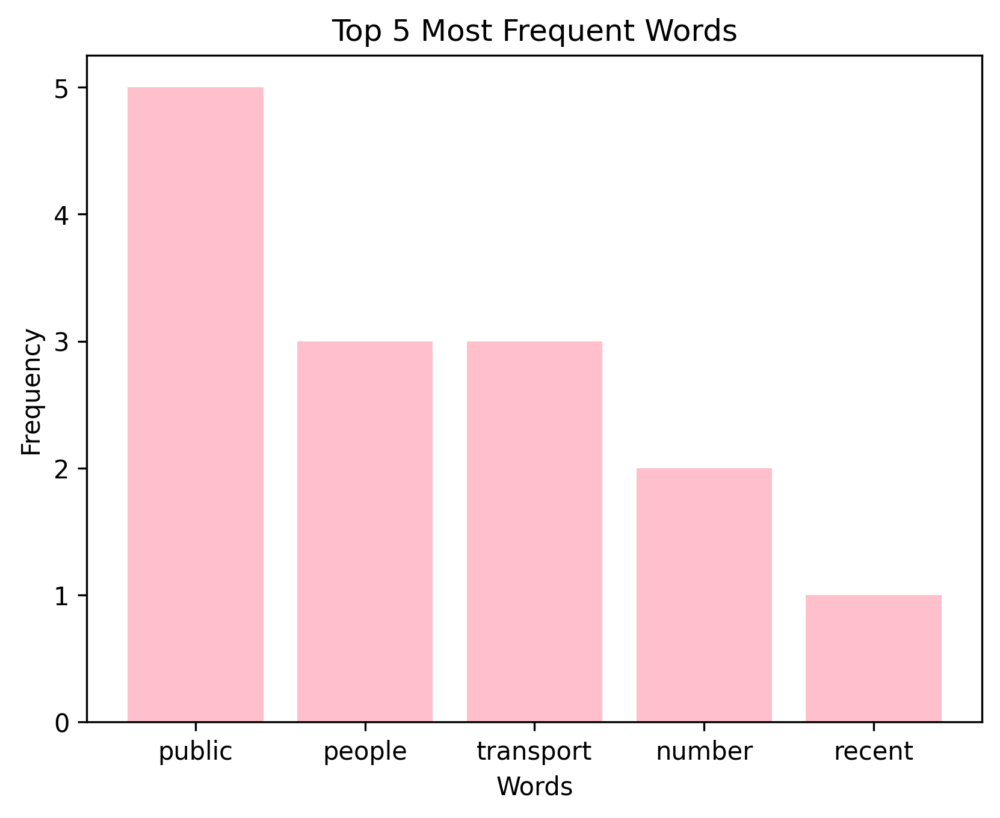

# Word Counts with Bag-of-Words (NLP Project)

This is a beginner-friendly natural language processing (NLP) project using Python and NLTK.

It demonstrates how to process a short text passage, remove stopwords, lemmatize words, build a bag-of-words model, and visualize the most frequent words using a bar chart.

---

## Steps Performed
- Tokenize and lowercase the text
- Remove English stopwords
- Lemmatize words using WordNet
- Count word frequency (Bag-of-Words)
- Visualize top 5 words using `matplotlib`

---

## Tools Used
- Python 3.x
- NLTK (Natural Language Toolkit)
- Matplotlib
- Counter (from `collections`)

---

## Example Output



---

## How to Run It

1. Clone or download the repo
2. Install required libraries (if not already installed):

```bash
pip install nltk matplotlib
